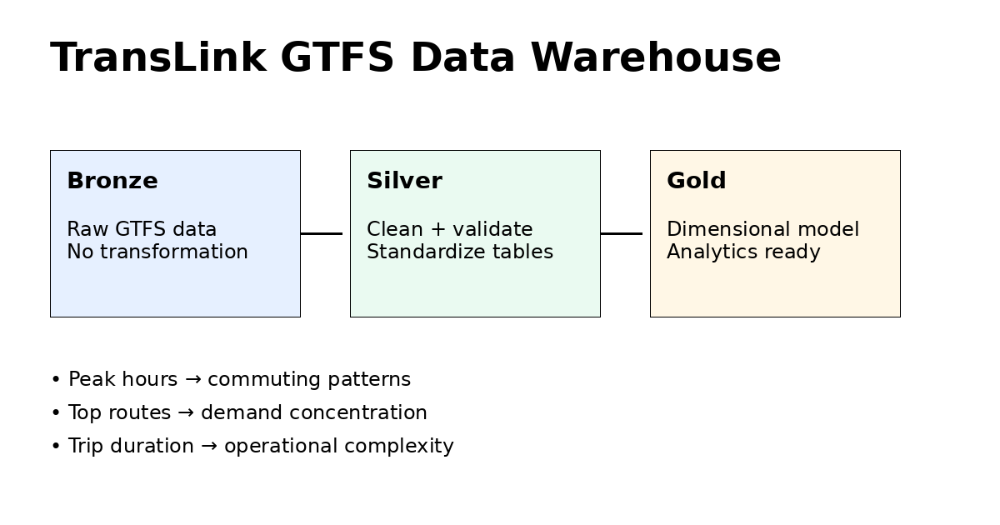
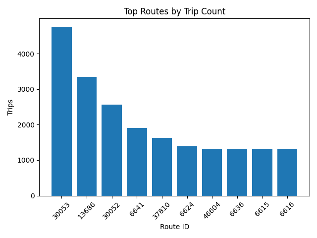
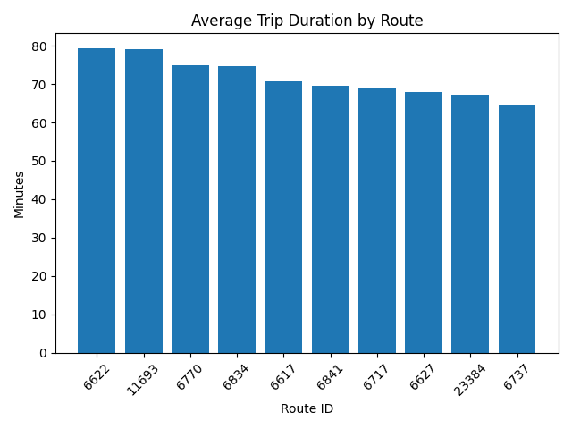
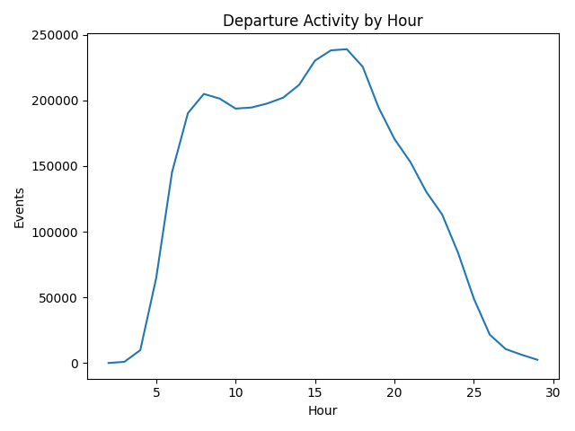

# TransLink GTFS Data Warehouse

A medallion-style data engineering project built on the TransLink GTFS feed, designed to move from raw transit data to a structured, analysis-ready warehouse.

---

## Goal

Design and implement a reliable data pipeline that transforms raw GTFS data into a dimensional model that supports real analytical questions.

The focus is on:

- preserving raw data fidelity at ingestion  
- enforcing data quality and consistency across layers  
- modeling data into fact and dimension tables  
- evolving the warehouse to support time-based analysis  

---

## Architecture

### Bronze

Raw ingestion layer.

- Stores GTFS tables exactly as received from the source zip  
- No transformation or filtering  
- Serves as the source of truth for all downstream layers  

Source: https://www.transit.land/feeds

---

### Silver

Cleaning and standardization layer.

- normalize column types and formats  
- enforce required keys (`trip_id`, `route_id`, `stop_id`, `service_id`)  
- remove duplicates  
- handle null values  
- prepare data for consistent downstream modeling  

---

### Gold

Warehouse layer for analytics.

Two versions are implemented to show how the model evolves from structure to usability.



---

## Warehouse Versions

### V1: Core Warehouse

Initial dimensional model built from cleaned GTFS data.

**Dimensions**
- `dim_agency`
- `dim_route`
- `dim_stop`
- `dim_service`
- `dim_trip`

**Facts**
- `fact_trip_summary`
- `fact_stop_time`

Focus:
- establishing a clean medallion pipeline  
- building a stable dimensional model  
- validating structure and data quality  

---

### V2: Time-Aware Warehouse

Extends the model to support real transit analysis.

Adds:

- `dim_date` derived from service calendars  
- normalization of GTFS time values (including times beyond 24:00:00)  
- derived metrics such as:
  - trip duration (minutes)
  - arrival and departure seconds
  - hourly service distribution  

**New table**
- `dim_date`

**Enhanced facts**
- `fact_trip_summary` includes trip duration  
- `fact_stop_time` includes time-based attributes  

Focus:
- enabling time-based analysis  
- handling domain-specific complexities of transit data  
- making the warehouse usable for real questions  

---

## Source Data

Real TransLink GTFS static feed.

Expected location:

```
data/raw/google_transit.zip
```

---

## Project Structure

```
transit_data_warehouse/
├── README.md
├── requirements.txt
├── data/
│   ├── raw/
│   ├── processed/
│   │   ├── bronze/
│   │   ├── silver/
│   │   ├── gold/
│   │   └── gold_v2/
├── src/
│   ├── pipeline.py
│   ├── bronze/
│   │   └── ingest.py
│   ├── silver/
│   │   └── transform.py
│   ├── gold/
│   │   ├── warehouse.py        # V1
│   │   └── warehouse_v2.py     # V2
├── tests/
│   ├── test_bronze.py
│   ├── test_silver.py
│   ├── test_gold.py
│   ├── test_gold_v2.py
│   └── run_all_tests.py
├── analysis/
│   ├── report_v2.py
│   └── output/
```

---

## Data Quality

Each layer is validated using assertion-based tests.

Checks include:

- required files exist  
- tables are not empty  
- required columns are present  
- key fields contain no null values  
- dimension keys are not duplicated  

Run all tests:

```
python tests/run_all_tests.py
```

Run V2 tests:

```
python tests/run_all_tests_v2.py
```

---

## How to Run

```
python -m venv .venv
source .venv/bin/activate
pip install -r requirements.txt
```

### Run full pipeline (V1)

```
python src/pipeline.py
```

### Run Gold V2

```
python src/gold/warehouse_v2.py
```

### Generate Analysis Report

```
python analysis/report_v2.py
```

---

## Example Analysis

Using the V2 warehouse, analytical outputs and visual summaries are generated to understand transit patterns.

### Top Routes by Trip Volume



High-frequency routes represent core transit corridors and service demand concentration.

---

### Average Trip Duration by Route



Longer routes highlight operational complexity and potential scheduling challenges.

---

### Service Activity by Hour



Clear peaks in service activity indicate commuting patterns and peak transit demand windows.

---

### Weekday vs Weekend Service

Data output available in:

```
analysis/output/weekday_vs_weekend_service.csv
```

This comparison shows how service levels shift between weekday operations and weekend schedules.

---

## Example Analytical Questions

The V2 model supports questions such as:

- Which routes run the highest number of trips?
- What are the busiest service hours across the network?
- What is the average trip duration by route?
- How does service differ between weekdays and weekends?

---

## Design Notes

- GTFS time values can exceed 24:00:00 and are normalized into seconds  
- Calendar data is expanded into a proper date dimension  
- Each layer depends only on the layer before it  
- The model evolves from structural correctness (V1) to analytical usability (V2)  

---

## Next Steps

- integrate `calendar_dates.txt` for service exceptions  
- build route-level and time-based aggregates  
- add orchestration (Airflow or Fabric pipelines)  
- migrate to PySpark for larger-scale processing  
- expose data through Power BI or SQL endpoints  

---

## Why this project matters

This project focuses on how data systems are built and improved over time.

It demonstrates:

- structuring data across layered architectures  
- enforcing data quality within pipelines  
- translating raw operational data into analytical models  
- handling domain-specific challenges such as GTFS time and serv
